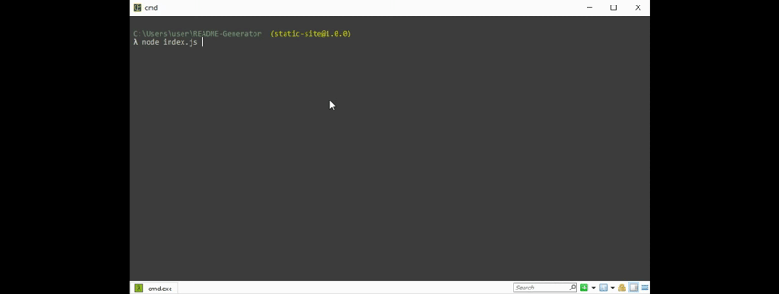

# Readme Generator
  
  ## Contents
  1. [Description](#Description)
  2. [Usage](#Usage)
  3. [Installation](#Installation)
  4. [Licenses](#Licenses)
  5. [Test](#Test)
  6. [Contributions](#Contributions)

  ### Description
 To automate the generation of README's to satisfactory degree

  ### Usage
  TO create readmes

  ### Installation
  1. Install NPM
  2. Install inquirer through npm
  3. Input node index.js into your favorite CLI

  ### License
  Licensed under the 

  ### Test
  

  ### Contribution
  Feel free to fork and tweak to your heart's content

  ## Contact me
  I can be contacted via my github
